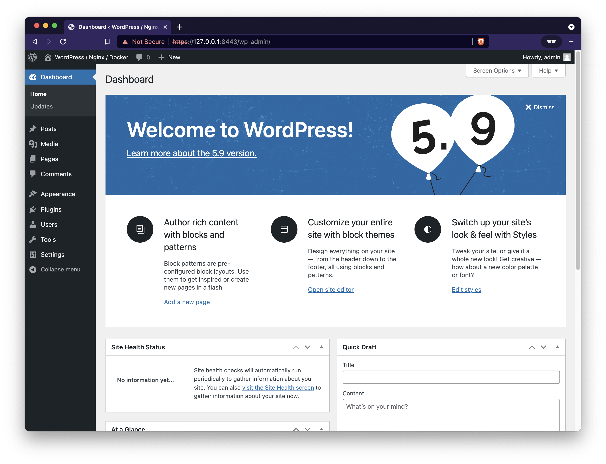
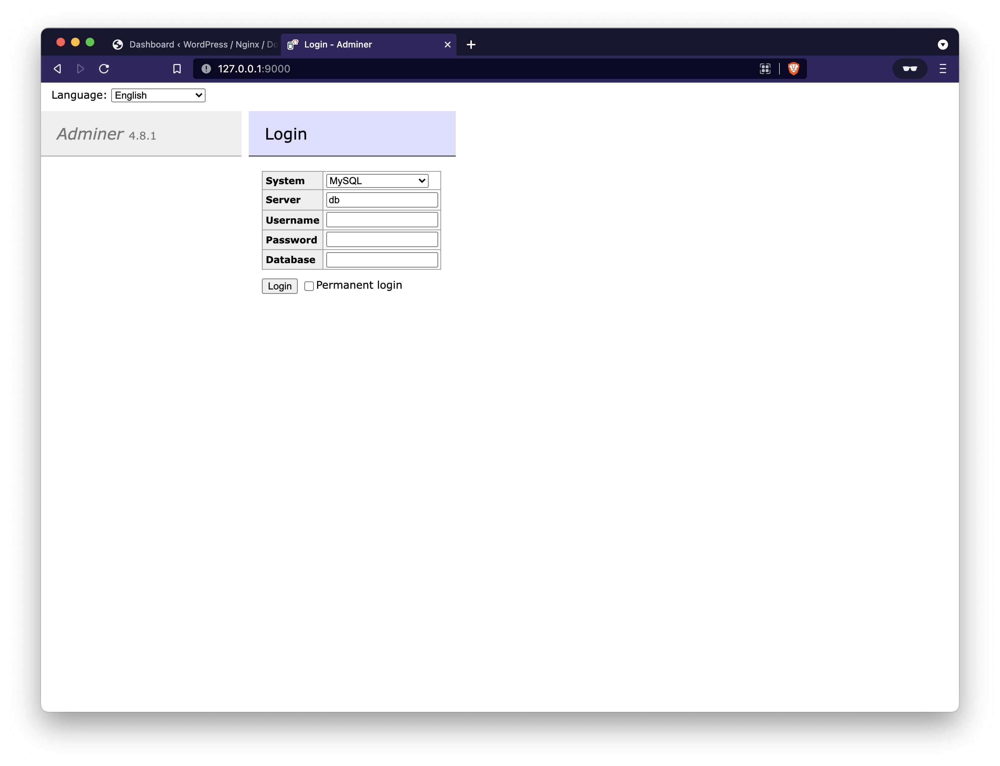
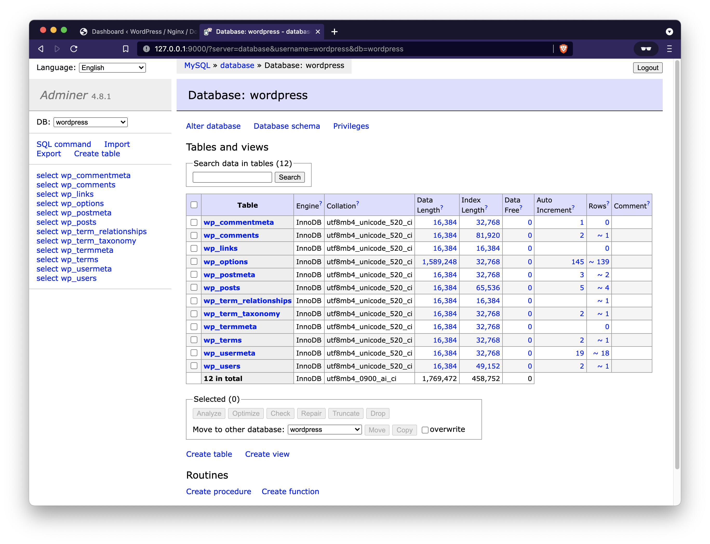
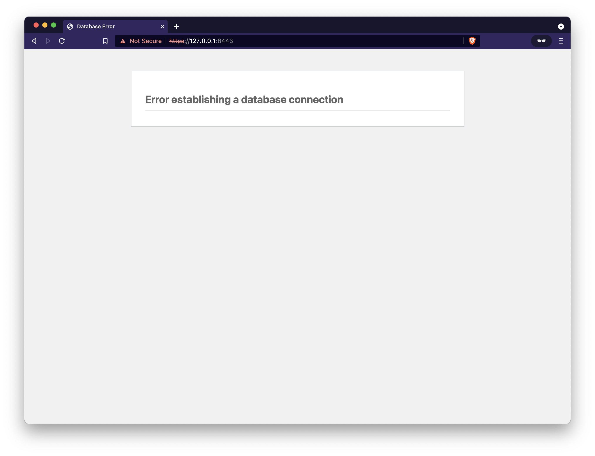

# WordPress Docker Deployment Guide

A comprehensive guide for setting up WordPress using Docker containers with FastCGI Process Manager (FPM), featuring a robust multi-container architecture for production-ready deployments.

**⚠️ Security Notice**: This codebase is provided as-is and may not reflect the latest security patches or best practices. Maintenance depends on active project requirements. Deploy responsibly and conduct your own security review before production use.

## 📋 Table of Contents

- [Architecture Overview](#architecture-overview)
- [Prerequisites](#prerequisites) 
- [Project Structure](#project-structure)
- [Environment Setup](#environment-setup)
- [Container Configuration](#container-configuration)
- [Deployment Process](#deployment-process)
- [Database Management](#database-management)
- [Maintenance & Cleanup](#maintenance--cleanup)
- [Troubleshooting](#troubleshooting)
- [Additional Resources](#additional-resources)

## 🏗️ Architecture Overview

This deployment leverages a multi-container Docker setup orchestrated through Docker Compose, providing a scalable and maintainable WordPress hosting solution.

### Technology Stack

| Component | Version | Purpose |
|-----------|---------|---------|
| WordPress | v5-fpm | Content Management System with FastCGI Process Manager |
| MySQL | v8 | Primary database storage |
| Nginx | v1 | Reverse proxy and web server |
| Adminer | v4 | Database administration interface |

### FastCGI Process Manager (FPM)

WordPress FPM variant utilizes PHP-FPM for enhanced performance and resource management. This implementation requires a reverse proxy (Nginx in our case) to handle HTTP requests and communicate with the PHP backend via the FastCGI protocol.

**Key Benefits:**
- Improved resource utilization
- Better process isolation
- Enhanced security through separation of concerns
- Scalable architecture suitable for high-traffic sites

For detailed PHP-FPM information, visit the [official PHP-FPM documentation](https://php-fpm.org/).

## 🔧 Prerequisites

Ensure your host system meets the following requirements before proceeding:

### Required Software

1. **Docker Engine** - Container runtime environment
   - Installation guide: [Docker Engine Installation](https://docs.docker.com/engine/install/)

2. **Docker Compose** - Multi-container orchestration tool
   - Installation guide: [Docker Compose Installation](https://docs.docker.com/compose/install/)

### System Verification

Verify your installation by running:

```bash
docker --version
docker-compose --version
```

## 📁 Project Structure

Your project directory should be organized as follows:

```
wordpress-docker/
├── .env                    # Environment configuration
├── docker-compose.yml     # Container orchestration
├── config/
│   └── uploads.ini        # PHP upload settings
├── nginx/
│   └── default.conf       # Nginx server configuration
├── ssl/                   # SSL certificates directory
├── logs/                  # Application logs
├── wordpress/             # WordPress files (auto-generated)
└── dbdata/               # MySQL data (auto-generated)
```

## ⚙️ Environment Setup

### Step 1: Environment Configuration

Create your environment file by copying the template:

```bash
cp env.template .env
```

Configure your `.env` file with the following settings:

```ini
# =================================================================
# Docker Compose Environment Configuration
# =================================================================
# Priority hierarchy for environment variables:
# 1. Compose file values
# 2. Shell environment variables  
# 3. Environment file (.env)
# 4. Dockerfile defaults
# 5. Undefined (will cause errors)

# =================================================================
# WordPress Configuration
# =================================================================
export WORDPRESS_LOCAL_HOME=./wordpress
export WORDPRESS_UPLOADS_CONFIG=./config/uploads.ini
export WORDPRESS_DB_HOST=database:3306
export WORDPRESS_DB_NAME=wordpress
export WORDPRESS_DB_USER=wordpress
export WORDPRESS_DB_PASSWORD=password123!

# =================================================================
# Database Configuration
# =================================================================
export MYSQL_LOCAL_HOME=./dbdata
export MYSQL_DATABASE=${WORDPRESS_DB_NAME}
export MYSQL_USER=${WORDPRESS_DB_USER}
export MYSQL_PASSWORD=${WORDPRESS_DB_PASSWORD}
export MYSQL_ROOT_PASSWORD=rootpassword123!

# =================================================================
# Web Server Configuration  
# =================================================================
export NGINX_CONF=./nginx/default.conf
export NGINX_SSL_CERTS=./ssl
export NGINX_LOGS=./logs/nginx

# =================================================================
# User Configuration
# =================================================================
# Reserved for future user-specific settings
```

### Step 2: SSL Certificate Setup

This deployment includes self-signed SSL certificates following [Let's Encrypt localhost specifications](https://letsencrypt.org/docs/certificates-for-localhost/). Place your certificate files in the `./ssl` directory:

- `fullchain.pem` - Complete certificate chain
- `privkey.pem` - Private key file

## 🔧 Container Configuration

### Nginx Web Server Setup

Update the `nginx/default.conf` file, replacing `$host` with your actual domain name and `443` with your desired HTTPS port:

```conf
# =================================================================
# Nginx Configuration for WordPress FPM
# =================================================================

# HTTP to HTTPS Redirect
server {
    listen 80;
    listen [::]:80;
    server_name $host;
    
    location / {
        # Redirect all HTTP traffic to HTTPS
        # Update port number to match your HTTPS configuration
        rewrite ^ https://$host$request_uri? permanent;
    }
}

# HTTPS Server Block
server {
    listen 443 ssl http2;
    listen [::]:443 ssl http2;
    server_name $host;
    
    # Document root and index files
    index index.php index.html index.htm;
    root /var/www/html;
    
    # Security settings
    server_tokens off;
    client_max_body_size 75M;

    # SSL Configuration
    # Update paths based on your certificate deployment
    ssl_certificate /etc/ssl/fullchain.pem;
    ssl_certificate_key /etc/ssl/privkey.pem;

    # Logging configuration
    access_log /var/log/nginx/wordpress.access.log;
    error_log /var/log/nginx/wordpress.error.log;

    # Security headers for enhanced protection
    add_header X-Frame-Options "SAMEORIGIN" always;
    add_header X-XSS-Protection "1; mode=block" always;
    add_header X-Content-Type-Options "nosniff" always;
    add_header Referrer-Policy "no-referrer-when-downgrade" always;
    add_header Content-Security-Policy "default-src * data: 'unsafe-eval' 'unsafe-inline'" always;

    # WordPress permalink handling
    location / {
        try_files $uri $uri/ /index.php$is_args$args;
    }

    # PHP processing via FastCGI
    location ~ \.php$ {
        try_files $uri = 404;
        fastcgi_split_path_info ^(.+\.php)(/.+)$;
        fastcgi_pass wordpress:9000;
        fastcgi_index index.php;
        include fastcgi_params;
        fastcgi_param SCRIPT_FILENAME $document_root$fastcgi_script_name;
        fastcgi_param PATH_INFO $fastcgi_path_info;
    }

    # Security: Deny access to .htaccess files
    location ~ /\.ht {
        deny all;
    }

    # Optimize static file delivery
    location = /favicon.ico {
        log_not_found off; 
        access_log off;
    }

    location = /favicon.svg {
        log_not_found off; 
        access_log off;
    }

    location = /robots.txt {
        log_not_found off; 
        access_log off; 
        allow all;
    }

    # Cache static assets
    location ~* \.(css|gif|ico|jpeg|jpg|js|png)$ {
        expires max;
        log_not_found off;
    }
}
```

### PHP Upload Configuration

Customize the `config/uploads.ini` file to set your preferred upload limits:

```ini
# =================================================================
# PHP Upload Configuration for WordPress
# =================================================================

# Enable file uploads
file_uploads = On

# Memory allocation for PHP processes
memory_limit = 256M

# Maximum file upload size
upload_max_filesize = 75M

# Maximum POST data size
post_max_size = 75M

# Maximum execution time for scripts
max_execution_time = 600
```

The current configuration supports **Maximum upload file size: 75 MB**, which will be reflected in your WordPress media settings.


## 🚀 Deployment Process

### Phase 1: Environment Preparation

Load your environment variables and download required Docker images:

```bash
# Load environment configuration
source .env

# Pull latest Docker images
docker-compose pull
```

### Phase 2: Database Initialization

Start the MySQL database container first to ensure proper initialization:

```bash
# Start database container
docker-compose up -d database
```

**Important**: Allow the database container sufficient time to complete initialization. Monitor the logs to confirm readiness:

```bash
# Monitor database startup progress
docker-compose logs database
```

Wait for output similar to this before proceeding:

```console
wp-database  | 2022-01-28 13:40:18+00:00 [Note] [Entrypoint]: Entrypoint script for MySQL Server 8.0.28-1debian10 started.
wp-database  | 2022-01-28 13:40:18+00:00 [Note] [Entrypoint]: Switching to dedicated user 'mysql'
wp-database  | 2022-01-28 13:40:18+00:00 [Note] [Entrypoint]: Entrypoint script for MySQL Server 8.0.28-1debian10 started.
wp-database  | 2022-01-28 13:40:18+00:00 [Note] [Entrypoint]: Initializing database files
...
wp-database  | 2022-01-28 13:40:28+00:00 [Note] [Entrypoint]: Creating database wordpress
wp-database  | 2022-01-28 13:40:28+00:00 [Note] [Entrypoint]: Creating user wordpress
wp-database  | 2022-01-28 13:40:28+00:00 [Note] [Entrypoint]: Giving user wordpress access to schema wordpress
wp-database  |
wp-database  | 2022-01-28 13:40:28+00:00 [Note] [Entrypoint]: Stopping temporary server
wp-database  | 2022-01-28T13:40:29.002886Z 13 [System] [MY-013172] [Server] Received SHUTDOWN from user root. Shutting down mysqld (Version: 8.0.28).
wp-database  | 2022-01-28T13:40:30.226306Z 0 [System] [MY-010910] [Server] /usr/sbin/mysqld: Shutdown complete (mysqld 8.0.28)  MySQL Community Server - GPL.
wp-database  | 2022-01-28 13:40:31+00:00 [Note] [Entrypoint]: Temporary server stopped
wp-database  |
wp-database  | 2022-01-28 13:40:31+00:00 [Note] [Entrypoint]: MySQL init process done. Ready for start up.
wp-database  |
...
wp-database  | 2022-01-28T13:40:32.061642Z 0 [System] [MY-011323] [Server] X Plugin ready for connections. Bind-address: '::' port: 33060, socket: /var/run/mysqld/mysqlx.sock
wp-database  | 2022-01-28T13:40:32.061790Z 0 [System] [MY-010931] [Server] /usr/sbin/mysqld: ready for connections. Version: '8.0.28'  socket: '/var/run/mysqld/mysqld.sock'  port: 3306  MySQL Community Server - GPL.
```

### Phase 3: Application Launch

Once the database is ready, start the remaining services:

```bash
# Launch WordPress and Nginx containers
docker-compose up -d wordpress nginx
```

Verify all containers are running correctly:

```bash
# Check container status
docker-compose ps
```

Expected output:

```console
NAME                COMMAND                  SERVICE             STATUS              PORTS
wp-database         "docker-entrypoint.s…"   database            running             33060/tcp
wp-nginx            "/docker-entrypoint.…"   nginx               running             0.0.0.0:80->80/tcp, 0.0.0.0:443->443/tcp
wp-wordpress        "docker-entrypoint.s…"   wordpress           running             9000/tcp
```

### Phase 4: WordPress Installation

Access your WordPress installation through your configured domain and port (e.g., [https://127.0.0.1:8443]()).

**Note**: You may need to accept the security warning for self-signed certificates.


Complete the WordPress installation wizard. Upon completion, you'll see your dashboard:




## 💾 Database Management

### Adminer Integration

Adminer provides a web-based database management interface. The configuration is included but commented out for security reasons.

**Security Recommendation**: Only enable Adminer when needed, as it bypasses the Nginx reverse proxy.

### Enabling Adminer

Uncomment the adminer section in your `docker-compose.yml`:

```yaml
# =================================================================
# Adminer Database Management Interface
# NOTE: Use only when needed - bypasses nginx security layer
# =================================================================
adminer:
  # Default internal port: 8080
  image: adminer:4
  container_name: wp-adminer
  restart: unless-stopped
  networks:
    - wordpress
  depends_on:
    - database
  ports:
    - "9000:8080"
```

Start the adminer container:

```bash
# Launch Adminer interface
docker-compose up -d adminer

# Expected output:
# [+] Running 2/2
#  ⠿ Container wp-database  Running                                                                                                      0.0s
#  ⠿ Container wp-adminer   Started                                                                                                      0.9s
```

### Accessing Adminer

Navigate to [http://127.0.0.1:9000/]() to access the Adminer interface.



Use these connection details:

| Field | Value |
|-------|-------|
| System | MySQL |
| Server | database |
| Username | wordpress |
| Password | password123! |
| Database | wordpress |

**Note**: The server value "database" works because Adminer runs in the same Docker network as the MySQL container.



### Securing Adminer

When finished with database management, stop and remove the Adminer container:

```bash
# Stop Adminer container
docker-compose stop adminer

# Remove Adminer container and volumes
docker-compose rm -fv adminer

# Expected output:
# Going to remove wp-adminer
# [+] Running 1/0
#  ⠿ Container wp-adminer  Removed                                                                                                       0.0s
```

## 🧹 Maintenance & Cleanup

### Complete Environment Teardown

To completely remove all containers, volumes, and generated files:

```bash
# Stop all running containers
docker-compose stop

# Remove containers and volumes
docker-compose rm -fv

# Remove Docker network
docker network rm wp-wordpress

# Clean up local directories (may require sudo)
rm -rf ./wordpress
rm -rf ./dbdata  
rm -rf ./logs
```

Expected teardown output:

```console
$ docker-compose stop
[+] Running 3/3
 ⠿ Container wp-nginx      Stopped                                                                                                     0.3s
 ⠿ Container wp-wordpress  Stopped                                                                                                     0.2s
 ⠿ Container wp-database   Stopped                                                                                                     0.8s

$ docker-compose rm -fv
Going to remove wp-nginx, wp-wordpress, wp-database
[+] Running 3/0
 ⠿ Container wp-nginx      Removed                                                                                                     0.0s
 ⠿ Container wp-database   Removed                                                                                                     0.0s
 ⠿ Container wp-wordpress  Removed                                                                                                     0.0s

$ docker network rm wp-wordpress
wp-wordpress

$ rm -rf ./wordpress
$ rm -rf ./dbdata
$ rm -rf ./logs
```

## 🔍 Troubleshooting

### Common Issues and Solutions

#### Database Connection Errors

**Symptom**: "Error establishing database connection" message



**Causes & Solutions**:
- WordPress container started before database was ready
- Database initialization still in progress
- Network connectivity issues between containers

**Resolution Steps**:
1. Check database container status: `docker-compose logs database`
2. Ensure database initialization completed (look for "ready for connections" message)
3. Restart WordPress container: `docker-compose restart wordpress`
4. Verify network connectivity: `docker-compose ps`

#### Port Exposure for Development

By default, database and WordPress containers don't expose ports externally. For development access:

**MySQL Database Access**:
Add to the database service in `docker-compose.yml`:
```yaml
ports:
  - "3306:3306"
```

**WordPress FPM Access**:
Add to the wordpress service in `docker-compose.yml`:
```yaml
ports:
  - "9000:9000"
```

### SSL Certificate Issues

For production deployments, consider using automated certificate management:

**Recommended Tool**: [EZ Let's Encrypt](https://github.com/RENCI-NRIG/ez-letsencrypt)

This shell script automates Let's Encrypt certificate issuance and renewal using Certbot's webroot method.

## 📚 Additional Resources

### Official Documentation

- [WordPress Docker Images](https://hub.docker.com/_/wordpress/) - Complete WordPress container documentation
- [MySQL Docker Images](https://hub.docker.com/_/mysql) - MySQL container configuration guide  
- [Nginx Docker Images](https://hub.docker.com/_/nginx/) - Nginx container setup instructions
- [Adminer Docker Images](https://hub.docker.com/_/adminer) - Database management tool documentation

### Best Practices

- Regular database backups using `mysqldump` or automated backup solutions
- Monitoring container logs for performance and security issues
- Implementing proper SSL certificate management for production
- Regular security updates for all container images
- Resource monitoring and scaling considerations for high-traffic sites

---

*This guide provides a foundation for WordPress deployment using Docker containers. Customize configurations based on your specific requirements and security policies.*